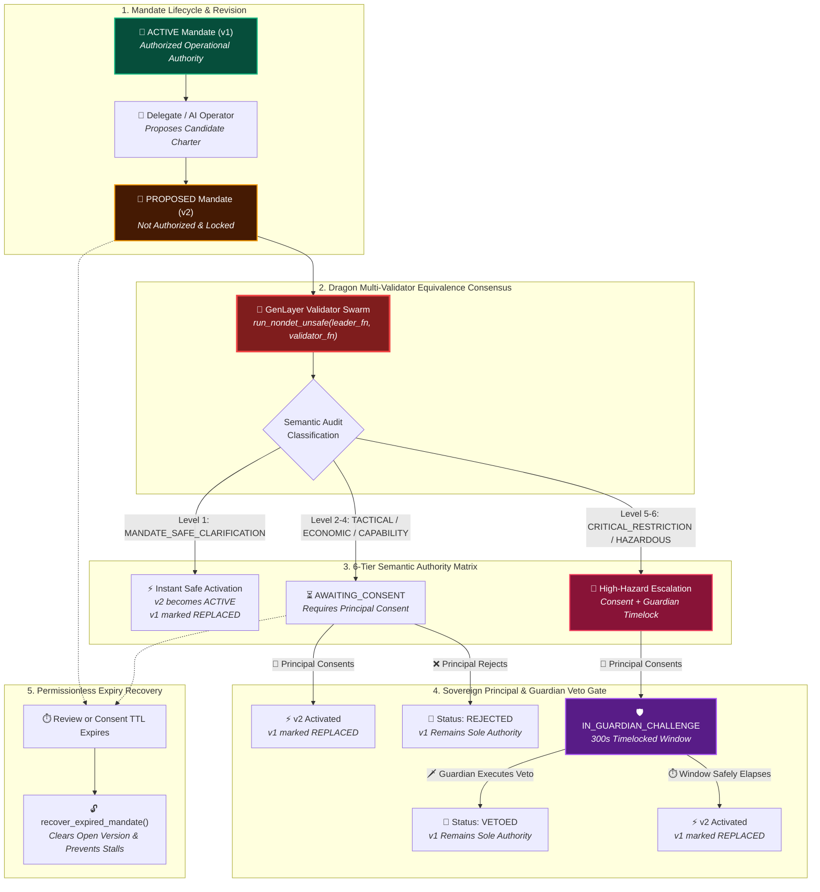

# 🐉 DracoClause

### Autonomous AI Agent Capability Charter & Semantic Mandate Guard on GenLayer StudioNet

> **"A proposed capability mandate is not authority. The last legitimately active version remains authoritative until the replacement is validly activated."**

[](https://studio.genlayer.com)
[](https://studio.genlayer.com)
[](LICENSE)

---

## ⚡ Deployment & Network Configuration

| Parameter | Specification Value |
|---|---|
| **Network Name** | `GenLayer StudioNet` |
| **Chain ID** | `61999` |
| **RPC Endpoint** | `https://studio.genlayer.com/api` |
| **Native Currency** | `GEN` |
| **Intelligent Contract** | `contracts/draco_clause.py` |
| **Consensus Engine** | GenLayer Multi-Validator Equivalence Consensus (`gl.vm.run_nondet_unsafe`) |
| **Direct Unit Tests** | `tests/direct/test_dracoclause.py` |

---

## 🛡️ The Problem: Silent Capability Drift in Autonomous AI Agents

When autonomous AI agents manage decentralized assets (DeFi liquidity provisioning, treasury rebalancing, DAO delegate voting, arbitrage), they operate under natural-language **Capability Mandates** that specify:
- Maximum daily drawdown and spending envelopes;
- Whitelisted target protocol adapters and execution methods;
- Slippage bounds and gas fee limits;
- Mandatory circuit breakers and emergency pause conditions.

Traditional cryptographic hashes can verify that text changed, but cannot determine whether an amendment:
1. Was a harmless wording clarification,
2. Raised a spending limit from `500 GEN` to `5,000 GEN`,
3. Expanded operational authority to unvetted third-party venues, or
4. Quietly removed emergency pause protections.

Centralized LLM judges introduce single-operator censorship and manipulation risks. **DracoClause** delegates semantic materiality review to decentralized GenLayer multi-validator consensus while keeping authorization consequences completely deterministic and fail-closed.

---

## 🐉 The Dragon Architecture & Governance Flow



---

## 🎯 6-Tier Dragon Semantic Taxonomy

| Semantic Class | Description | Re-Consent Required | Guardian Window Required |
|---|---|:---:|:---:|
| `MANDATE_SAFE_CLARIFICATION` | Typo fixes, formatting, non-substantive semantic rewording | ❌ No | ❌ No |
| `TACTICAL_SLIPPAGE_TWEAK` | Minor parameter, slippage, or gas fee ceiling adjustments | ✅ Yes | ❌ No |
| `ECONOMIC_ENVELOPE_EXPANSION` | Spending limit hikes, daily drawdown ceiling expansion | ✅ Yes | ❌ No |
| `CAPABILITY_ESCALATION` | New smart contract targets, authorized external methods | ✅ Yes | ❌ No |
| `CRITICAL_RESTRICTION_REMOVAL` | Removing or weakening safety checks, pausing rules, blacklists | ✅ Yes | ✅ Yes (300s+) |
| `HAZARDOUS_ADVERSARIAL_DRIFT` | Hostile prompt injection, jailbreak attempts, extreme escalation | ✅ Yes | ✅ Yes (300s+) |

---

## 🔒 Core Invariants & Security Defenses

1. **Fail-Closed Verification Hook**:
   - Downstream protocols and AI agents query `is_mandate_authorized(mandate_id, version)`.
   - Returns `True` **only** if `version == active_version` and `status == ACTIVE`. Stale, proposed, awaiting-consent, vetoed, or expired versions always return `False`.
2. **Untrusted Evidence Prompt Framing**:
   - All mandate texts and charter rules are wrapped in `<charter_rules>`, `<active_mandate>`, and `<proposed_mandate>` evidence tags.
   - The LLM evaluator is defensively instructed to treat contents strictly as data and ignore embedded prompt overrides.
3. **Independent Validator Recomputation**:
   - Validators in `run_nondet_unsafe` independently re-run the semantic audit from source evidence.
   - Consensus requires exact agreement across both the boolean re-consent flag and the specific semantic class.
4. **Deterministic Optimization**:
   - Byte-identical submissions immediately resolve to `MANDATE_SAFE_CLARIFICATION` without incurring LLM latency.
5. **Guardian Veto Window**:
   - High-hazard proposals trigger a timelocked challenge window where appointed security sentinels can veto rogue parameter expansions.

---

## 🛠️ Verification & Reproduction Commands

### 1. Contract Static Analysis
```bash
python scripts/verify_static.py
```

### 2. Direct Unit Test Suite
```bash
python -m pytest tests/direct -v
```

### 3. Frontend Development Workspace
```bash
cd frontend
npm install
npm run dev
```

---

## 👥 Authors & Contributors
- **9ja_maxx** (`9ja-maxx`) — Lead Architect & Creator

---

<div align="center">
<b>DracoClause</b> &middot; <i>Autonomous AI Agent Capability Charter & Semantic Guard</i> &middot; GenLayer StudioNet (Chain ID: 61999)
</div>